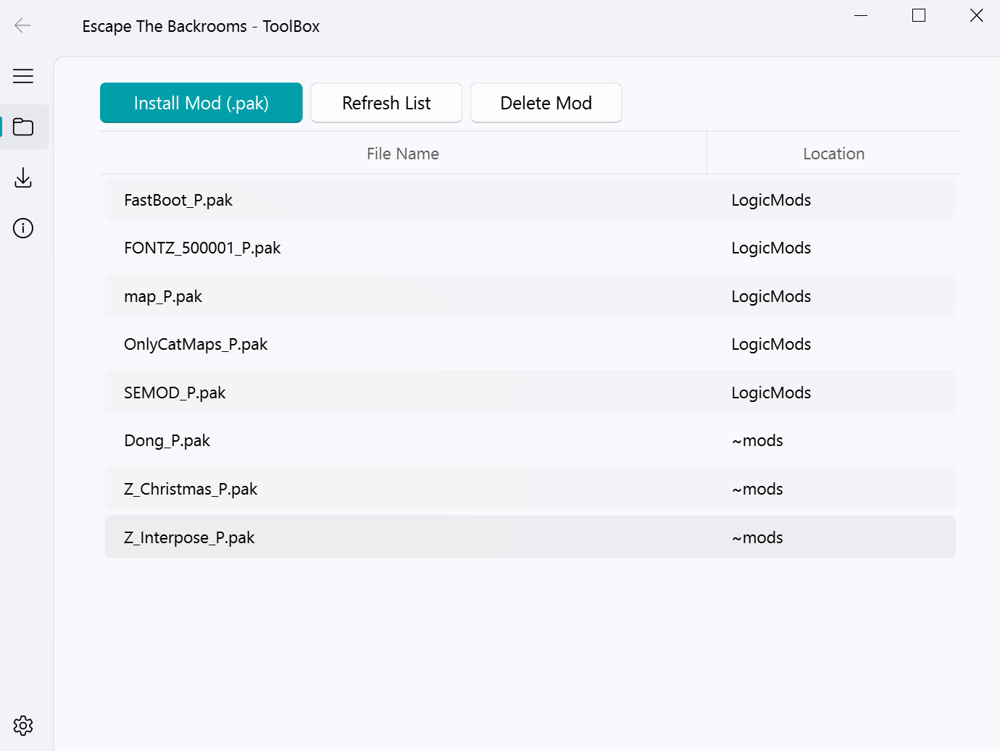
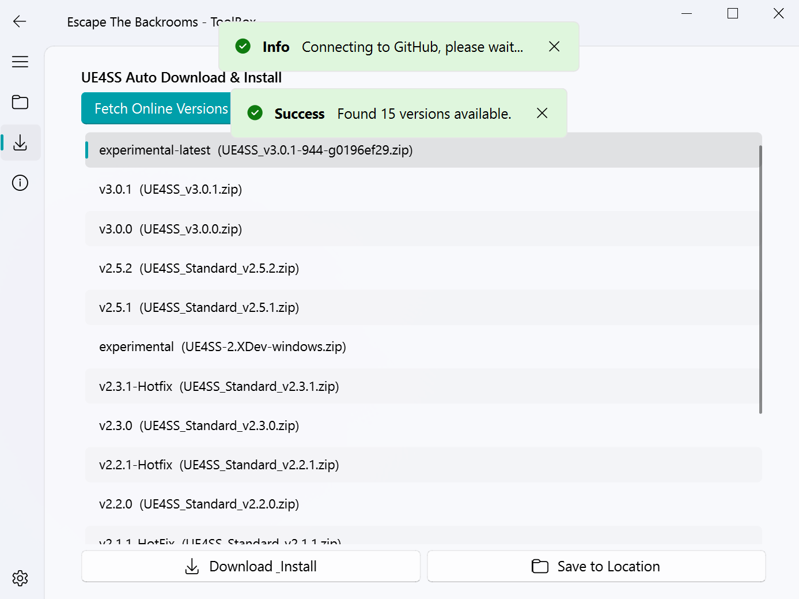
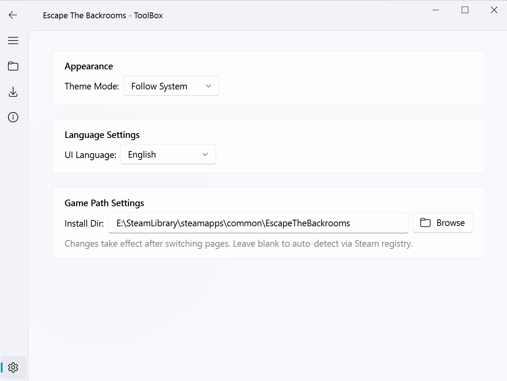

<div align="center">

English | [**简体中文**](README_CN.md)

# Escape The Backrooms - Comprehensive Management ToolBox

A Mod management and environment configuration tool for *Escape The Backrooms*, built with Python and PyQt-Fluent-Widgets. Featuring a Windows 11 Fluent Design UI, it offers a simple and elegant interaction, freeing you from tedious manual file copying.


</div>

## 📥 Download & Installation (Recommended for Regular Users)

No need to configure a Python environment. Simply download the packaged executable, extract it, and run!

👉 **[Click here to go to the Release page for the latest version](https://github.com/SEDET666/EscapeTheBackrooms-Mod-Management-Tool/releases/latest)**

*(Note: After extracting, if Windows shows a security warning, click "More info" -> "Run anyway")*

---

## ✨ Features

- 🎮 **Convenient Mod Management**: Automatically scans the Paks directory and intelligently filters out vanilla files. Supports one-click installation (automatically categorized into `LogicMods`), multi-selection deletion, and right-click shortcut operations.
- 🚀 **UE4SS One-Click Deployment**: Automatically fetches the official GitHub Release version list with a built-in download acceleration node. Supports one-click download and automatic extraction to the game's core directory, or pure download to a custom location.
- 🎨 **Modern UI Design**: Deeply integrated with the Fluent Widgets component library, supporting seamless switching between Follow System/Light/Dark theme modes.
- 🔍 **Smart Path Detection**: Automatically reads the Steam registry on startup to accurately locate the game. Supports manual browsing if the path is lost, with persistent configuration saving.

## 📸 UI Preview





---

## 🛠️ Run from Source (For Developers)

If you want to modify the code or contribute to development, please follow these steps:

1. **Clone the repository**
   ```bash
   git clone https://github.com/SEDET666/EscapeTheBackrooms-Mod-Management-Tool.git
   ```

2. **Install dependencies**
   Ensure Python 3.8+ is installed, then execute in the project directory:
   ```bash
   pip install PySide6 PyQt-Fluent-Widgets requests
   ```

3. **Run the program**
   ```bash
   python EscapeTheBackroomsModManagementTool.py
   ```

## 📁 Directory & Logic Explanation

- **Default Mod Install Path**: `.../EscapeTheBackrooms/Content/Paks/LogicMods/` (Created automatically if it doesn't exist)
- **Default UE4SS Install Path**: `.../EscapeTheBackrooms/EscapeTheBackrooms/Binaries/Win64/` (Automatically extracts and overwrites)
- **Local Config File**: `tool_config.json` in the software root directory (Saves your theme choice and custom game path, no manual modification needed)

## 👨‍💻 Developer Information

- **Developer**: SEDT
- **QQ**: 248881284
- **QQ Group**: [929296000](https://qm.qq.com/cgi-bin/qm/qr?k=qkHKToHIP3AAhcGo4NPqCVV4tBGA_Wct&jump_from=webapi&authKey=Ow+OtF2suJcrafPY0wxAVWHwWLX0BtZIxn2u8a+Z+A6uh/04bSLIfoKspY4j9C1K) (Click to join)

## ⚠️ Disclaimer

This tool is an open-source learning and exchange project, intended solely for personal and convenient management of game files. Please ensure you comply with the game's relevant user agreements when using Mods and UE4SS. The developer assumes no responsibility for any game bans, file corruption, or other issues caused by the use of this tool.

## 📄 Open Source License

This project is open-sourced under the [GNU General Public License v3.0 (GPL-3.0)](LICENSE).
**Important Note**: According to the GPL protocol, any project that references or modifies this code and publishes it must also be open-sourced under the GPL-3.0 protocol and must retain the original author's copyright notice.

---

<div align="center">

**If you find this project helpful, please give it a ⭐ Star!**

</div>
