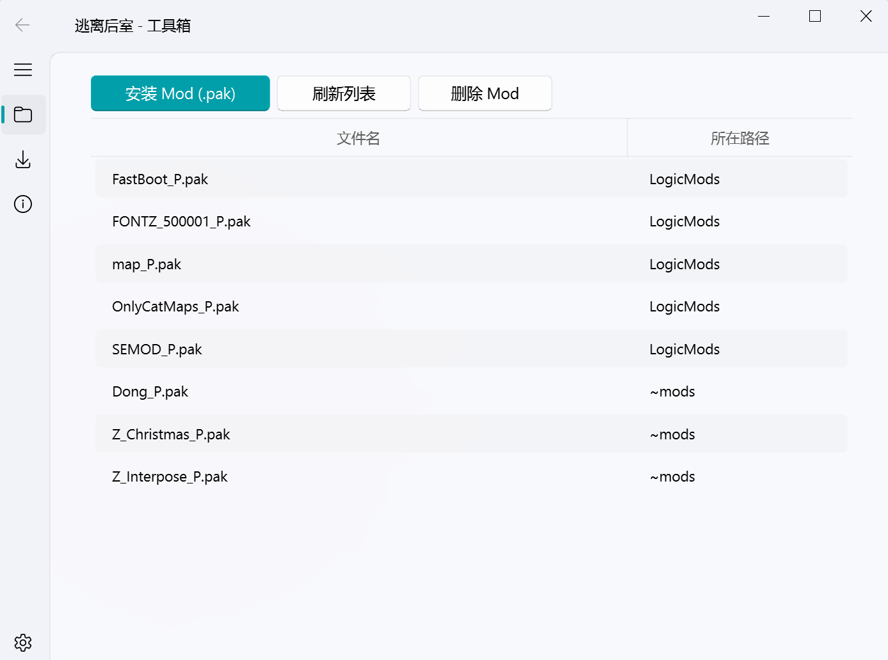
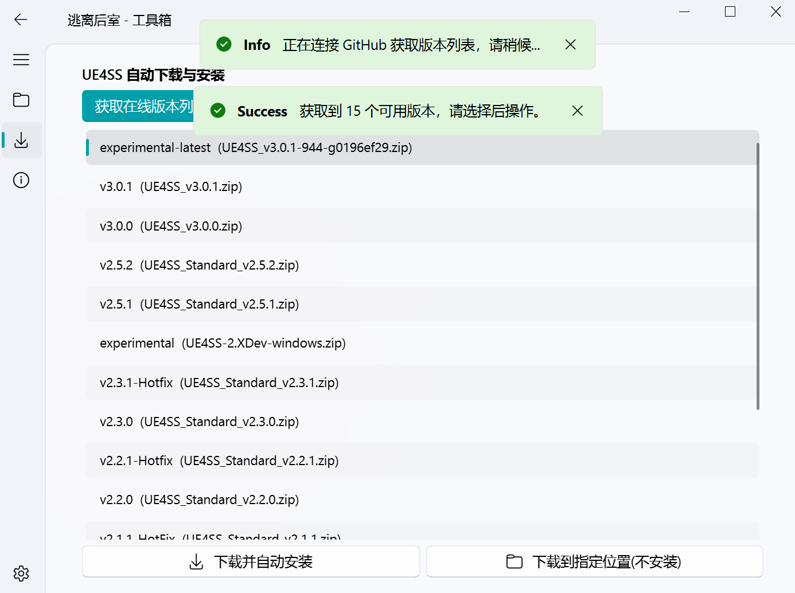
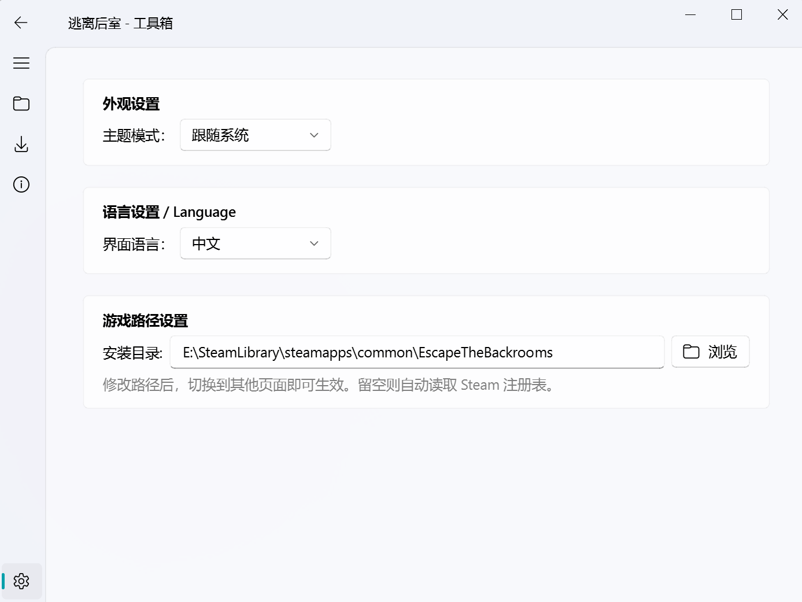

<div align="center">
  
[**English**](README_EN.md) | 简体中文

# 逃离后室 - 综合管理工具箱

一款基于 Python 和 PyQt-Fluent-Widgets 打造的《逃离后室》Mod管理与环境配置工具。界面采用 Windows 11 Fluent Design 风格，交互简洁优雅，让你告别繁琐的手动拷贝。


</div>

## 📥 下载与安装 (普通用户推荐)

无需配置 Python 环境，直接下载打包好的可执行程序，解压即可运行！

👉 **[点击前往 Release 页面下载最新版本](https://github.com/SEDET666/EscapeTheBackrooms-Mod-Management-Tool/releases/latest)**

*(注：下载解压后，如果 Windows 弹出安全警告，点击“更多信息” -> “仍要运行”即可)*

---

## ✨ 功能特性

- 🎮 **便捷的 Mod 管理**：自动扫描 Paks 目录，智能过滤原版文件。支持一键安装（自动归类至 `LogicMods`）、多选删除、右键快捷操作。
- 🚀 **UE4SS 一键部署**：自动抓取 GitHub 官方 Release 版本列表，内置下载加速节点，支持一键下载并自动解压安装至游戏核心目录，也支持自定义位置纯下载。
- 🎨 **现代化 UI 设计**：深度适配 Fluent Widgets 组件库，支持跟随系统/浅色/深色三种主题模式无缝切换。
- 🔍 **智能路径识别**：启动自动读取 Steam 注册表精准定位游戏，路径丢失时支持手动浏览指定，配置持久化保存。

## 📸 界面预览





---

## 🛠️ 从源码运行 (开发者)

如果你想自己修改代码或者参与开发，请按以下步骤操作：

1. **克隆本仓库**
   ```bash
   git clone https://github.com/SEDET666/EscapeTheBackrooms-Mod-Management-Tool.git
   ```

2. **安装依赖库**
   确保已安装 Python 3.8+，然后在项目目录执行：
   ```bash
   pip install PySide6 PyQt-Fluent-Widgets requests
   ```

3. **运行程序**
   ```bash
   python EscapeTheBackroomsModManagementTool.py
   ```

## 📁 目录与逻辑说明

- **Mod 默认安装路径**：`.../EscapeTheBackrooms/Content/Paks/LogicMods/` (若不存在会自动创建)
- **UE4SS 默认安装路径**：`.../EscapeTheBackrooms/EscapeTheBackrooms/Binaries/Win64/` (自动解压覆盖)
- **本地配置文件**：软件根目录下的 `tool_config.json` (保存了你的主题选择和自定义游戏路径，无需手动修改)

## 👨‍💻 开发者信息

- **开发者**：SEDET
- **QQ**：248881284
- **交流群**：[929296000](https://qm.qq.com/cgi-bin/qm/qr?k=qkHKToHIP3AAhcGo4NPqCVV4tBGA_Wct&jump_from=webapi&authKey=Ow+OtF2suJcrafPY0wxAVWHwWLX0BtZIxn2u8a+Z+A6uh/04bSLIfoKspY4j9C1K) (点击直接加群)

## ⚠️ 免责声明

本工具为开源学习交流项目，仅供个人便捷管理游戏文件使用。请确保在使用 Mod 和 UE4SS 时遵守游戏的相关用户协议，因使用本工具导致的任何游戏封号、文件损坏等问题，开发者不承担任何责任。

## 📄 开源协议

本项目基于 [GNU General Public License v3.0 (GPL-3.0)](LICENSE) 开源。
**重要提示**：根据 GPL 协议规定，任何引用或修改本代码并发布的项目，也必须同样以 GPL-3.0 协议开源，且必须保留原作者的版权声明。

---

<div align="center">

**如果觉得这个项目有帮助，欢迎给个 ⭐ Star！**

</div>
